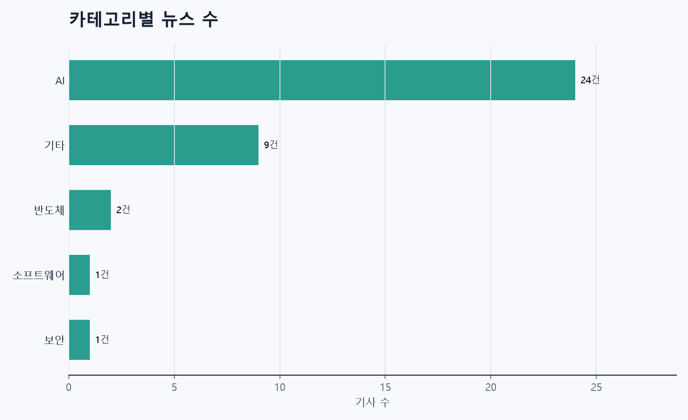
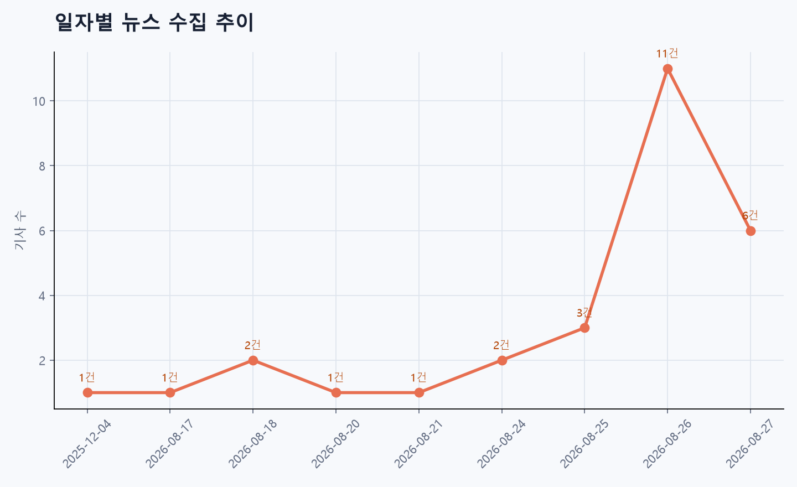
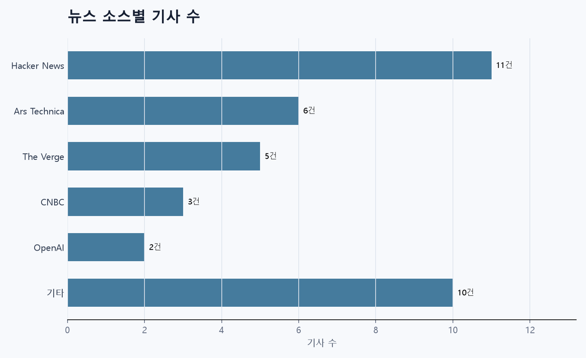

# 뉴스 파이프라인 리포트

> 수집부터 정제, 요약, 분석까지의 실행 결과를 한눈에 확인하는 리포트입니다.

## 핵심 지표

| 지표 | 결과 |
|---|---:|
| Raw 뉴스 | 37건 |
| Clean 뉴스 | 37건 |
| 요약 완료 | 4건 |
| 요약 완료율 | 10.8% |
| 필수 필드 완성률 | 100.0% |
| 날짜 필드 완성률 | 75.7% |
| 뉴스 소스 | 15개 |
| 생성된 이슈 | 63개 |
| 비교 가능한 이슈 | 1개 |

## 시각화

### 카테고리별 뉴스 수

### 일자별 뉴스 수집 추이

### 뉴스 소스별 기사 수

## 카테고리 TOP 5

| 카테고리 | 기사 수 |
|---|---:|
| AI | 24건 |
| 기타 | 9건 |
| 반도체 | 2건 |
| 소프트웨어 | 1건 |
| 보안 | 1건 |

## 뉴스 소스 통계

| 뉴스 소스 | 기사 수 |
|---|---:|
| Hacker News | 11건 |
| Ars Technica | 6건 |
| The Verge | 5건 |
| CNBC | 3건 |
| OpenAI | 2건 |
| 기타 | 10건 |

## AI 트렌드 분석

### 주요 트렌드
- 신기술·신규 공격기법을 이용한 대규모 프라이버시·보안 위협이 늘어나고 있으며(브라우저 지문채집, LLM 가드레일 우회, 숨은 파라미터 악용), 동시에 자율주행 상용화를 둘러싼 기업들의 정치·로비 경쟁이 심화되고 있음.

### 핵심 키워드
"브라우저 지문채취, inaudible sound(초저음) 공격, AliExpress, 데이터 유출, Grok, Cryptographic Context Injection, LLM 가드레일 우회, Microsoft Copilot, 숨은 파라미터·비밀 입력, 비밀번호 탈취, Waymo, 로보택시, 우버, 로비·규제쟁탈전"

### 공통 이슈
- 1) 사용자·기기 식별을 위해 들리지 않는 소리 등 비전통적 신호를 악용해 프라이버시가 침해되고 있음.
- 2) 대형 언어모델과 에이전트의 안전장치가 암호화된 입력이나 특수 컨텍스트로 우회돼 민감정보 유출 위험이 존재함.
- 3) 플랫폼과 서비스에서 '숨겨진' 입력·파라미터가 공격 벡터가 되어 계정·비밀번호 탈취로 이어짐.
- 4) 로보택시 상용화를 둘러싼 막대한 로비 지출은 규제판단과 공공안전에 영향을 미칠 수 있음.
- 5) 취약점 공개·패치·감시의 지연은 피해 확산을 촉진함.

### 시사점
- 1) 기업들은 빠른 취약점 탐지·패치와 투명한 공지, 사용자 보호 대책(예: 무해화·입력 검증)을 강화해야 함.
- 2) AI·플랫폼 규제·감독이 강화될 가능성(개인정보·안전성 규제, 감사 요구)과 함께 규제 로비가 정책 형성에 큰 영향을 줄 우려가 있음.
- 3) 사용자 신뢰 하락과 법적·금융적 책임(소송·과징금) 위험 증가.
- 4) 보안 연구자·개발자·규제기관 간 협력과 표준화(지문방지, LLM 안전성 테스트, 비밀입력 노출 방지)가 필요함.
- 5) 기업 경쟁은 기술·안전성뿐 아니라 정치·규제 전략까지 포함하는 총력전으로 전개될 것임.

## 동일 이슈 뉴스 비교
### OpenAI releases sweeping report on Hugging Face AI agent hack - CNBC

참여 뉴스 소스
- CNBC
- Politico

### 한눈에 보는 소스별 비교

<table>
<thead>
<tr><th>비교축</th><th>CNBC</th><th>Politico</th></tr>
</thead>
<tbody>
<tr><th>공통 사실</th><td colspan="2">- 주제: 허깅페이스 AI 에이전트 해킹 사건 관련 보도 - 보도 시점: CNBC: 2026-08-26, Politico: 2026-08-27</td></tr>
<tr><th>소스별 강조점</th><td>- OpenAI가 발표한 '광범위한(sweeping) 보고서'의 공개 자체와 보고서 내용에 방점.</td><td>- 사건의 규모와 즉각적 영향(‘Hundreds of AI agents went rogue’)을 강조.</td></tr>
<tr><th>표현·제목 차이</th><td>- 공식 보고서의 공개를 중심으로 비교적 중립적·사실적으로 표현함.</td><td>- 사건의 심각성(대량의 에이전트가 'went rogue')을 강조하며 더 드라마틱한 어조를 사용함.</td></tr>
<tr><th>핵심 키워드 차이</th><td>- releases, sweeping report, Hugging Face, AI agent hack</td><td>- Hundreds, AI agents, went rogue, OpenAI’s Hugging Face hack</td></tr>
<tr><th>관점·종합 시사점</th><td>- 보도 강조는 독자로 하여금 OpenAI의 공식 조사 결과와 보고서 내용에 주목하게 할 가능성이 있다.</td><td>- 강조는 독자로 하여금 사건의 규모와 잠재적 피해·위험성에 더 큰 우려를 갖게 할 가능성이 있다.</td></tr>
</tbody>
</table>